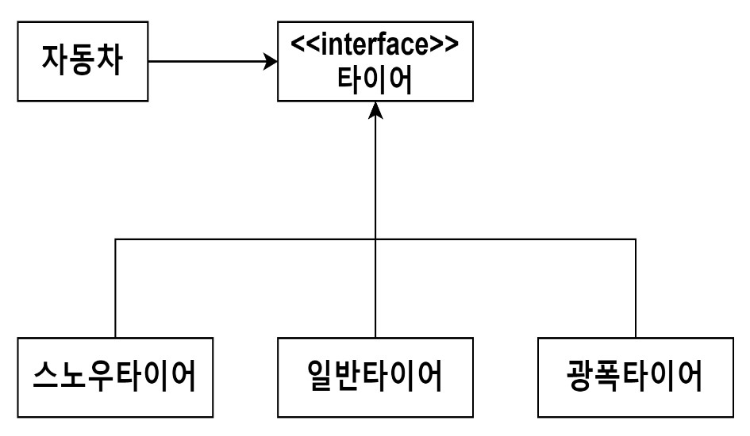

<스프링 입문을 위한 자바 객체 지향의 원리와 이해 194 ~ 196p>

### DIP(Dependency Inversion Principle) - 의존 역전 원칙

"고차원 모듈은 저자원 모듈에 의존하면 안 된다.  
이 두 모듈 모두 다른 추상화된 것에 의존해야 한다."  
"추상화된 적은 구체적인 것에 의존하면 안 된다.  
구체적인 것이 추상화된 것에 의존해야 한다."  
"자주 변경되는 구체(Concrete) 클래스에 의존하지 마라 "  
- 로버트 C, 마틴

- 위 사진처럼 자동차가 구체적인 타이어들(스노우타이어, 일반타이어, 광폭타이어)이 아닌  
타이어 인터페이스에만 의존하게 함으로써 스노우타이어에서 일반타이어로, 또는 다른 구체적인 타이어로 변경돼도  
자동차는 이제 그 영향을 받지 않는 형태로 구성된다.

"자신보다 변하기 쉬운 것에 의존하지 마라"

 
    
상위 클래스일수록, 인터페이스일수록, 추상 클래스일수록 변하지 않을 가능성이 높기에 하위 클래스나   
구체 클래스가 아닌 상위 클래스, 인터페이스, 추상 클래스를 통해 의존하라는 것이 바로 의존 역전 원칙이다.