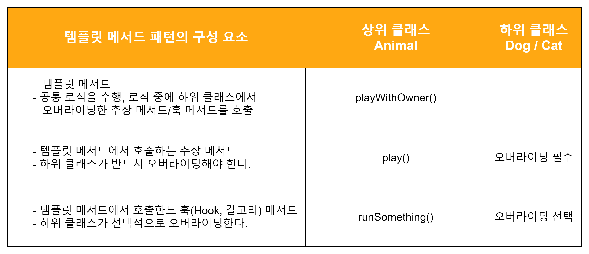

<스프링 입문을 위한 자바 객체 지향의 원리와 이해 219 ~ 222p>

### 팩터리 메서드 패턴(Factory Method Pattern)

- 공장은 물건을 생산하는데 객체 지향에서 팩터리는 객체를 생성한다.
- 결국 팩터리 메서드는 객체를 생성 반환하는 메서드를 말한다.  
  여기에 패턴이 붙으면 하위 클래스에서 팩터리 메서드를 오버라이딩해서 객체를 반환하게 하는 것을 의미
- 템플릿 메서드 패턴은 의존 역전 원칙(DIP)을 활용하고 있다.

  

## 한줄 정리
"상위 클래스의 견본 메서드에서 하위 클래스가 오버라이딩한 메서드를 호출하는 패턴"

