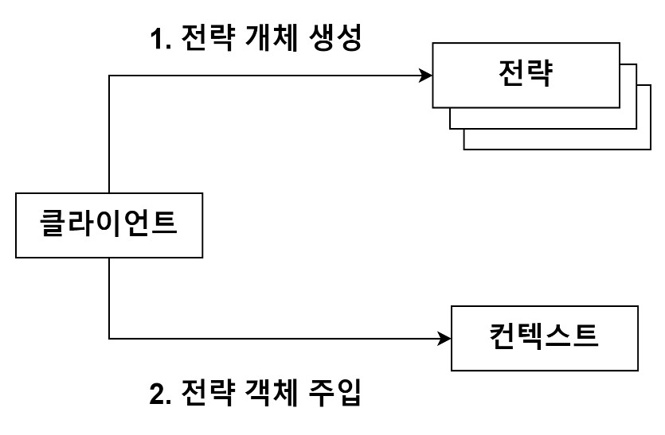
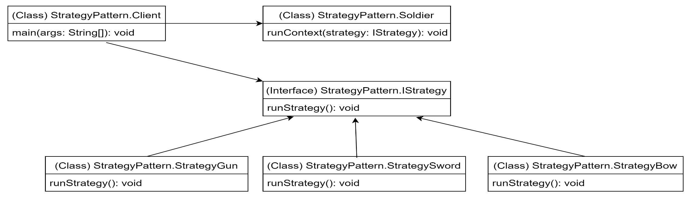

<스프링 입문을 위한 자바 객체 지향의 원리와 이해 222 ~ 227p>

## 전략 패턴(Strategy Pattern)

### 전략 패턴을 구성하는 세 요소

- 전략 메서드를 가진 전략 객체
- 전략 객체를 사용하는 컨텍스트(전략 객체의 사용자/소비자)
- 전략 객체를 생성해 컨텍스트에 주입하는 클라이언트(제3자, 전략 객체의 공급자)

  

큰라이언트는 다양한 전략 중 하나를 선택해 생성한 후 컨텍스트에 주입한다.  
=> 다양한 전략을 공통된 방식으로 사용하기 위해 인터페이스를 정의해야 한다.

- 템플릿 메소드 패턴과 유사하다.
- 전략 패턴은 디자인 패턴의 꽃으로 불릴 정도로 다양한 곳에서 다양한 문제의 상황의 해결책으로 사용된다.
- 같은 문제의 해결책으로 상속을 이용하는 템플릿 메서드 패턴, 객체 주입을 통한 전략 패턴 중 선택/적용할 수 있다.

!! 단일 상속만이 가능한 자바 언어에서는 상속이라는 제한이 있는 템플릿 메서드 패턴보다는 전략 패턴이 더 많이 활용된다.

  

"클라이언트가 전략을 생성해 전략을 실행할 컨텍스트에 주입하는 패턴"