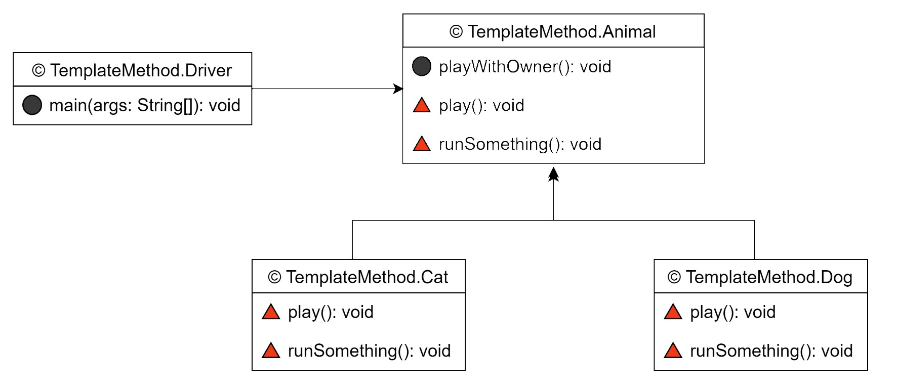

<스프링 입문을 위한 자바 객체 지향의 원리와 이해 214 ~ 218p>

### 템플릿 메서드 패턴(Template Method Pattern)

상위 클래스에 공통 로직을 수행하는 템플릿 메서드와 하위 클래스에 오버라이딩을 강제하는  
추상 메서드 또는 선택적으로 오버라이딩할 수 있는 훅(Hook) 메서드를 두는 패턴이다.  

### 클래스 다이어그램 

  

 

### 템플릿 메서드 패턴 정리
  

"상위 클래스의 견본 메서드에서 하위 클래스가 오버라이딩한 메서드를 호출하는 패턴"  

클래스 다이어그램을 보면 템플릿 메서드 패턴이 의존 역전 원칙(DIP)을 활용하고 있음을 알 수 있다.