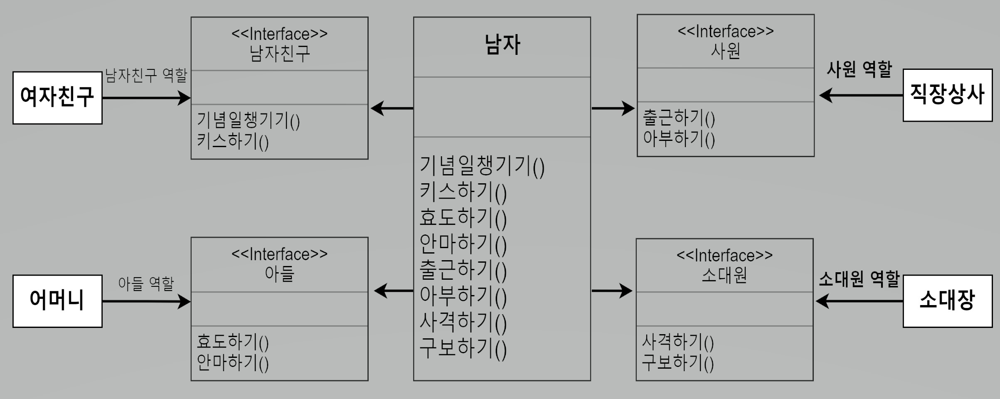

<스프링 입문을 위한 자바 객체 지향의 원리와 이해 186 ~ 188p>

### ISP(Interface Segregation Principle) - 인터페이스 분리 원칙

- SRP(단일 책임 원칙)에서 하나의 역할(책임)만 하는 다수의 클래스로 분할하는 것이였다면,  
  ISP는 인터페이스 각 역할을 인터페이스로 제한 하는 것이다.
- 결론적으로 SRP와 ISP는 같은 문제에 대한 두 가지 다른 해결책이라고 볼 수 있다.  
  하지만 틀별한 경우가 아니라면 단일 책임 원칙을 적용 하는 것이 더 좋은 해결책이라고 할 수 있다.
- ISP를 이야기할 때 항상 함께 등장하는 원칙 중 하나는 인터페이스 최소주의 원칙이다.  
  인터페이스를 통해 메서드를 외부에 제공할 때 최소한의 메서드만 제공하라는 것이다.

