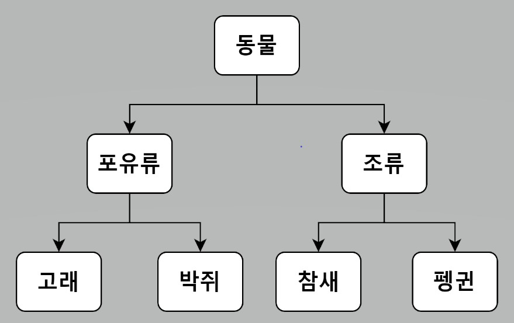

<스프링 입문을 위한 자바 객체 지향의 원리와 이해 186 ~ 188p>

### LSP(Liskov Substitution Principle) - 리스코프 치환 원칙

**"서브 타입은 언제나 자신의 기반 타입(base type)으로 교체할 수 있어야 한다."**  
-로버트 C.마틴-

---
## 상속이 만족해야 하는 조건

- 하위 클래스 is a kind of 상위 클래스 - 하위분류는 상위 분류의 한 종류다.
- 구현 클래스 is able to 인터페이스 - 구현 분류는 인터페이스할 수 있어야 한다.

위 두 개의 문장대로 구현된 프로그램이라면 이미 리스코프 치환 원칙을 잘 지키고 있다고 할 수 있다.

## 상속은 계층도 형태가 아니다!

**아버지 춘향이 = new 딸();**

- 위에 작성한 코드를 해석하면 딸을 하나 낳아서 이름을 춘향이라고 지었는데 아빠의 역할을 맡기고 있다.   
 *춘향이는 아버지형 객체 참조 변수이기에 아버지 객체가 가진 행위(메서드)를 할 수 있어야 한다.

위 코드가 아니라

**동물 뽀로로 = new 펭귄();**

이렇게 작성된 코드가 분류도 형태로 논리적으로 맞다.

- 펭귄 한마리가 태어나 뽀로로라 이름을 짓고 동물의 행위(메서드)를 하게 하는데 전형 이상함이 없다.

**"하위 클래스의 인스턴스는 상위형 객체 참조 변수에 대입해 상위 클래스의 인스턴스 역할을 하는 데 문제가 없어야 한다."**   
-로버트 C.마틴-

### 상속이 잘못 적용됐을 때 발생하는 문제점 3개
1. 하위형에서 선행 조건은 강화될 수 없다.
2. 하위형에서 후행 조건은 악화될 수 없다.
3. 하위형에서 상위형의 불변 조건은 반드시 유지돼야 한다.

자세한 내용(아래 링크 참고)  
http://ko.wikipedia.org/wiki/리스코프_치환_원칙