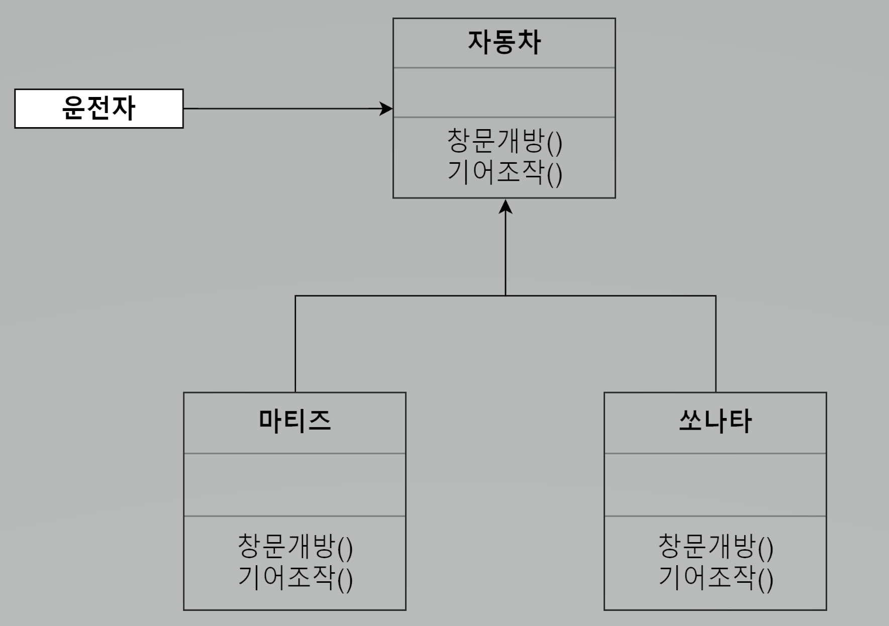
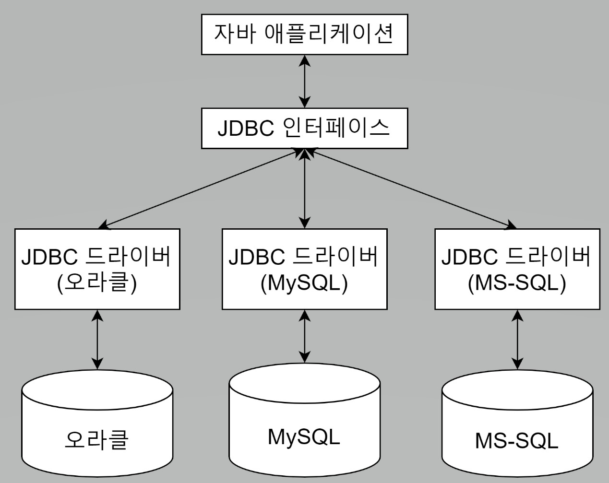

<스프링 입문을 위한 자바 객체 지향의 원리와 이해 183 ~ 186p>

### OCP(Open Closed Principle) - 개방 폐쇄 원칙

"소프트웨어 엔티티(클래스, 모듈, 함수 등)는 확장에 대해서는 열려 있어야 하지만 변경에 대해서는 닫혀 있어야 한다."  
    - 로버트 C.마틴 -

"자신의 확장에는 열려 있고, 주변의 변화에 대해서는 닫혀 있어야 한다."

-----

* 그림과 같이 상위 클래스 또는 인터페이스를 중간에 둠으로써 다양한 자동차가 생긴다고 해도  
  객체 지향 세계의 운전자는 운전 습관에 영향을 받지 않게 된다.
* 다양한 자동차가 생긴다고 하는 것은 자동차 입장에서는 자신의 확장에는 개방돼 있는 것이고,  
  운전자 입장에서는 주변의 변화에 폐쇄돼 있는 것이다.
 
 

- JDBC를 사용하는 클라이언트는 데이터베이스가 오라클에서 MySQL로 바뀌더라도 Connection 설정하는 부분 외에는 따로 수정 할 필요가 없다.
- 오라클을 MySql이나 MS-SQL로 교체할 때 자바 애플리케이션은 JDBC 인터페이스라고 하는 완충 장치로 인해 변화에 영향을 받지 않는다.
- 자바 애플리케이션은 데이터베이스라고 하는 주변의 변화에는 닫혀있는 것이다.  
  데이터베이스를 교체한다는 것은 데이터베이스가 자신의 확장에는 열려 있다는 것이다.

## 개방폐쇄 원칙을 따르지 않으면?
- 객체 지향 프로그램을 구현하는 것이 불가능한 것은 아니지만,  
  객체 지향 프로그래밍의 가장 큰 장점인 유연성, 재사용성, 유지보수성을 얻을 수 없다.
- 개방 폐쇄 원칙에 대한 좋은 예로 스프링 프레임워크가 있다.